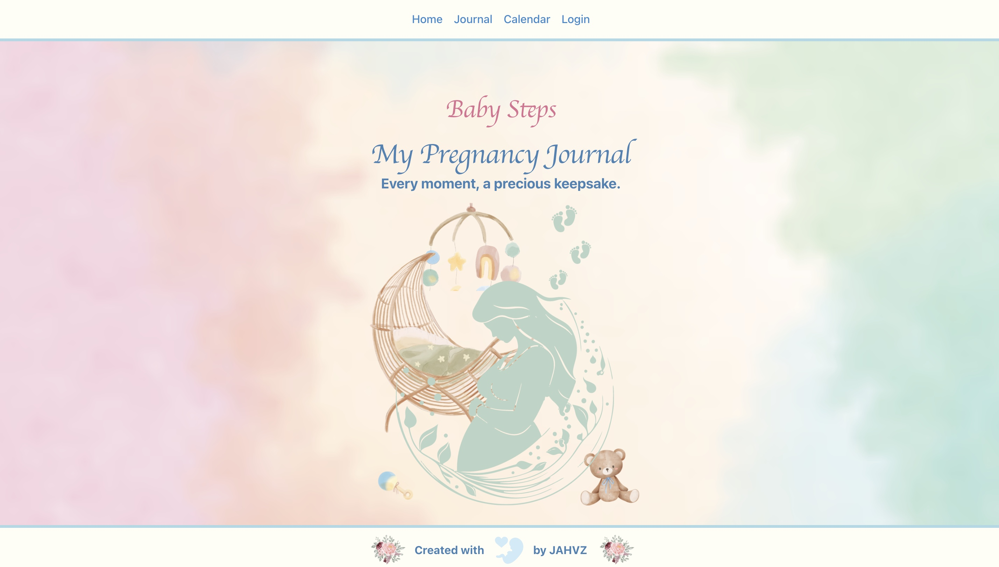
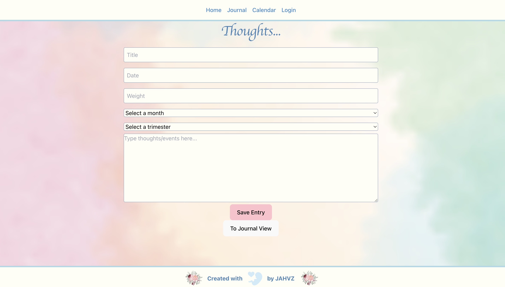
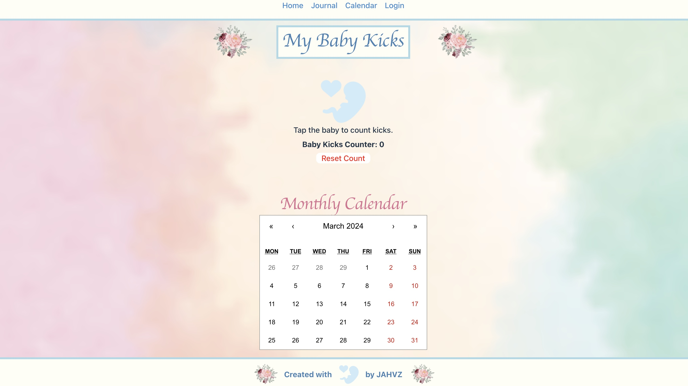

# Baby Steps
 

## Description

Check out our app that allows users to document their pregnancy journey! 

This MERN Stack application allows users to create a journal to track their pregnancy progress. Save pictures, put appointments on the calendar, and even make use of the kick counter in the journal to report to your Doctor during visits.

## Usage

deploy link: https://baby-steps.onrender.com 

A view of the home page.

The Journal page where users may document their progress or view previous entries.

The Calendar page where users may add appointments or plan visits.

## Credits

*Front End
- Helen Colon
- Vanessa Trinh
- Zion Griffin

*Back End
- Alphonse Kusluch
- Jeffrey Cummings

## License

Please refer to the license in the repository

